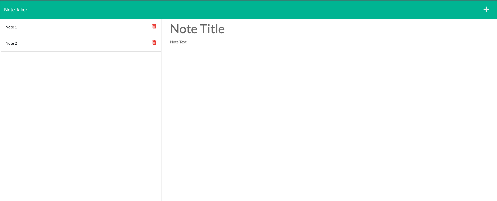

# Note-taker (Express.js Challenge). 
  
## Description
  
The application can be used to write and save notes. This application will use an Express.js back end and will save and retrieve note data from a JSON file.

## Table of Contents
- [Installation](#installation)
- [Usage](#usage)
- [Contributing](#contributing)
- [Test instructions](#test-instructions)
- [License](#tlicense)
- [Questions](#questions)

## Installation

For the application to work correctly, you need to download and install Node.js and npm.  Detailed instructions can be found by clicking on the link <https://nodejs.org/en/>.  You also need to install express v4.16.4 and uuid v8.3.2
  
## Usage
The application is available via the link.  To add a new note you must click on the plus icon, to save the note you must click on the save icon.  To delete an existing note click on the delete icon opposite a note title.
### Web page screenshot

  
## Contributing

Pull requests are welcome. For major changes, please open an issue first to discuss what you would like to change. Please make sure to update tests as appropriate.

## License

### The MIT license
  (https://opensource.org/licenses/MIT)

## Questions

If you have any questions please contact me any time!

My GitHhub: <https://github.com/kas500>

My email: <krasnikovanton84@gmail.com>